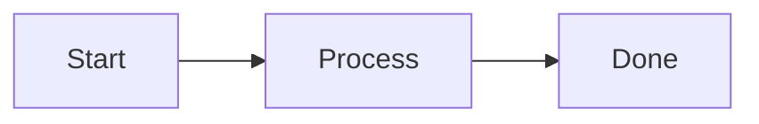

# Contributing to Scorpion Knowledge Base

Thanks for contributing. This guide summarizes the current project setup, content structure, and component usage in this repository.

- [Local setup](#local-setup)
- [Content structure](#content-structure)
- [Frontmatter conventions](#frontmatter-conventions)
- [Components (available and used)](#components-available-and-used)
- [Images](#images)
- [Authorship](#authorship)
- [Style and naming](#style-and-naming)
- [Pull request checklist](#pull-request-checklist)

## Local setup

This project is built with [Astro Starlight](https://starlight.astro.build/).

1. Install [Node.js](https://nodejs.org/) (LTS recommended).
2. Clone the repository:

```bash
git clone https://github.com/scorpion-monitoring/scorpion-knowledgebase
cd scorpion-knowledgebase
```

3. Install dependencies (preferred):

```bash
pnpm install
```

4. Start local development:

```bash
pnpm dev
```

5. Validate before opening a PR:

```bash
pnpm build
```

`pnpm build` catches broken links and content issues.

## Content structure

- Documentation pages: `src/content/docs/**`
- Author metadata: `src/content/authors/*.yml`
- Images/assets: `src/assets/images/**`

Create new pages as `.md` or `.mdx` in the matching section folder.

## Frontmatter conventions

Typical page frontmatter:

```yaml
---
title: My Page Title
lastUpdated: 2026-03-25
authors:
  - manuel-feser
sidebar:
  order: 1
---
```

Use `sidebar.order` to control page order inside a section.

## Components (available and used)

### Starlight components used in content

Import from `@astrojs/starlight/components`:

```mdx
import { Steps, Card, CardGrid, Tabs, TabItem, FileTree } from '@astrojs/starlight/components'
```

Used examples exist in `src/content/docs/index.mdx` and `src/content/docs/01-about/for-contributors.mdx`.

### Custom MDX components used in docs

#### PersonaSays

Component: `src/components/personas/PersonaSays.astro`  
Used in API docs and contributor examples.

```mdx
import PersonaSays from '@components/personas/PersonaSays.astro'

<PersonaSays persona="doro">
How do I authenticate and avoid repeating boilerplate in every API call?
</PersonaSays>
```

Supported personas: `nick`, `doro`, `ines`, `paul`.

#### Mermaid

Component: `src/components/mdx/Mermaid.astro`  
Used in concept pages and contributor examples.

````mdx
import Mermaid from '@components/mdx/Mermaid.astro'

<Mermaid title="Example flow">

</Mermaid>
````

### Homepage testimonial components

These are used on the docs landing page (`src/content/docs/index.mdx`):

- `src/components/TestimonialGrid.astro`
- `src/components/Testimonial.astro`

Example:

```mdx
import TestimonialGrid from '../../components/TestimonialGrid.astro'
import Testimonial from '../../components/Testimonial.astro'

<TestimonialGrid title="What Our Users Say">
  <Testimonial name="Manuel" handle="feserm" cite="https://github.com/feserm">
    We use Scorpion for our Service Portfolio Management.
  </Testimonial>
</TestimonialGrid>
```

### Internal layout components

These are wired through Astro/Starlight config and usually not imported directly in docs:

- `src/components/starlight/MarkdownContent.astro`
- `src/components/starlight/Footer.astro`
- `src/components/AuthorCard.astro`

## Images

Store images in `src/assets/images` using topic-specific subfolders.

In Markdown/MDX:

```md

```

For custom sizing in MDX:

```mdx
import ExampleImage from '@images/path/to/image.png'


```

## Authorship

Add or update author files in `src/content/authors`.

Example (`src/content/authors/jane-doe.yml`):

```yaml
name: Jane Doe
image: "@images/authors/jane-doe.jpg"
socials:
  - icon: simple-icons:github
    href: https://github.com/janedoe
affiliation: Example Institute
styling:
  text: JDO
```

Reference in page frontmatter:

```yaml
authors:
  - jane-doe
```

## Style and naming

- Use **kebab-case** for folders and file names.
- Prefer reusable components over repeating complex markup.
- Keep pages in Markdown/MDX; avoid raw HTML unless necessary.
- Do not use `<br />` for spacing.

## Pull request checklist

- [ ] Content is in the correct section/folder.
- [ ] Frontmatter is complete and valid.
- [ ] Images are in `src/assets/images/**` with meaningful names.
- [ ] New/changed links work.
- [ ] `pnpm build` succeeds locally.
