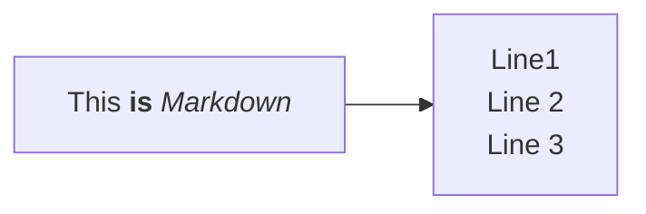

### Astro starlight components

import { Steps } from '@astrojs/starlight/components';
import { Card } from '@astrojs/starlight/components';
import { FileTree } from '@astrojs/starlight/components';
import { Tabs, TabItem } from '@astrojs/starlight/components';

#### Steps

<Steps>

    1. Step 1
    2. Step 2
    3. ...

</Steps>

#### Cards

<Card icon="pen" title="SomeCard">

    this is a Card

</Card>

#### File Tree 

<FileTree>
        - assays
            - **SugarMeasurement**
                - dataset
                    - ...
                - protocols
                    - ...
                - isa.assay.xlsx
                - README.md
            - ...
</FileTree>


#### Tabs

<Tabs syncKey="pl">

{/* FSHARP */}
<TabItem label="FSharp" icon='seti:f-sharp'>

```fsharp
open ARCtrl

let arc = ARC()
```
</TabItem>

{/* JAVASCRIPT */}
<TabItem label="JavaScript" icon='seti:javascript'>

```js
import {ARC} from "@nfdi4plants/arctrl";

let arc = new ARC()
```
</TabItem>

</Tabs>


### Viola Chat Bubble

import PersonaSays from '@components/personas/PersonaSays.astro'

<PersonaSays persona="nick">
This is a chat bubble with nick
</PersonaSays>

<PersonaSays persona="doro">
This is a chat bubble with doro
</PersonaSays>

<PersonaSays persona="ines">
Lorem ipsum dolor sit amet, consectetur adipiscing elit. Sed do eiusmod tempor incididunt ut labore et dolore magna aliqua. Ut enim ad minim veniam, quis nostrud exercitation ullamco laboris nisi ut aliquip ex ea commodo
</PersonaSays>


<PersonaSays persona="paul">
This is a chat bubble with paul
</PersonaSays>

### Mermaid support

import Mermaid from '@components/mdx/Mermaid.astro'

<Mermaid>

</Mermaid>


## Authorship

Authors listed via a file in [`src/content/authors`](src/content/authors) can easily be mentioned in the yaml header of articles. 

For example `src/content/authors/kevin-frey.yml`:

```yaml
name: Kevin Frey
image: "@images/authors/kevin-frey.jpg"
socials:
  - icon: simple-icons:github
    href: https://github.com/Freymaurer
  - icon: simple-icons:orcid
    href: https://orcid.org/0000-0002-8510-6810
affiliation: DataPLANT
styling:
  text: KFR
```

The author is linked simply via yaml article metadata

```yaml
authors:
  - kevin-frey
```

