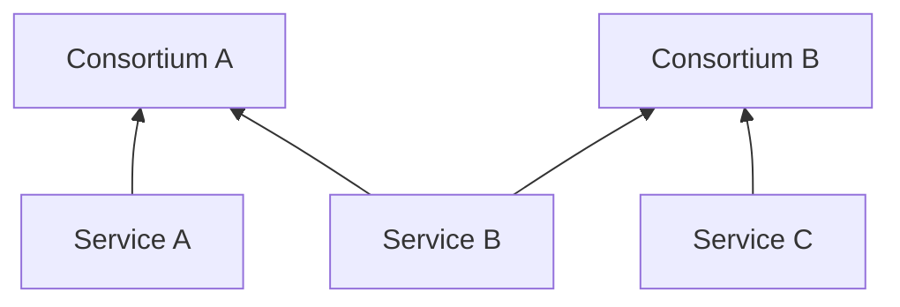

import Mermaid from '@components/mdx/Mermaid.astro'

In Scorpion, a consortium is a collection of services that are grouped together based on being part of the same project service portfolio.
A service can be part of multiple consortia, and a consortium can contain multiple services.

<Mermaid>

</Mermaid>

In this example, Service A is part of Consortium A, while Service B is part of both Consortium A and Consortium B, and Service C is part of Consortium B.
Consortia are used to group services together for reporting and evaluation purposes. 
They allow reviewers to evaluate services as part of a specific project or portfolio, and to generate reports for specific consortia and their services.