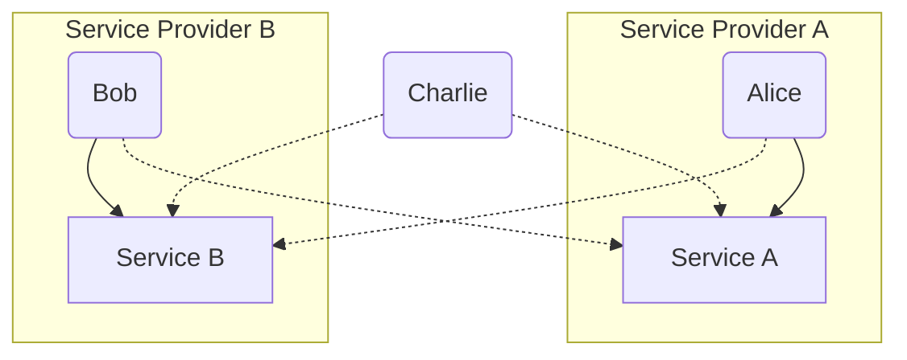

import Mermaid from '@components/mdx/Mermaid.astro'

Scorpion manages permissions for users by assigning them to groups. Each group provides a set of services that its members can access. 
Users can be part of multiple groups. 
While users can view measurements from all services, they can only register services for groups they are a member of and only submit measurements for services they have access to.

<Mermaid>

</Mermaid>

This means that in this example Alice can only register and submit measurements for Service A, Bob can only register and submit measurements for Service B, while Charlie can view measurements for both services but cannot register or submit measurements for either service.

## User Roles

Additionally to group memberships, users can have different roles that define their level of access and permissions within the system.

### User

Users with the "User" role can view measurements for all services, but they can only register and submit measurements for services that are associated with the groups they are members of.

### Reviewer

Users with the "Reviewer" role have the same permissions as "User" role, but they can also access the "Service Evaluation" page. This allows them to generate reports for consortia and their services.

### Administrator

Users with the "Administrator" role have full access to all features and functionalities of the system. They have access to the "Administration" page, where they can manage users, groups, categories and indicators.