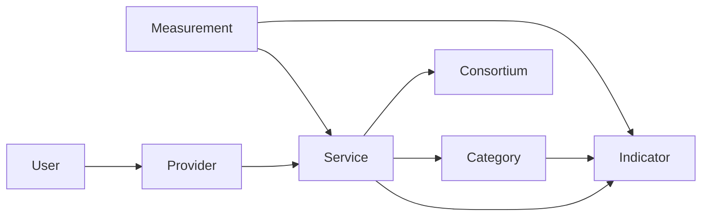

import Mermaid from '@components/mdx/Mermaid.astro'

<Mermaid>

</Mermaid>

Scorpion is a system that allows you to monitor the performance of your services. It consists of several components that work together to provide you with insights into the performance of your services. The main components of the system are:
- **Measurement**: A measurement is a single data point that represents the performance of a service at a specific point in time. It links to an indicator and a service, and consists of a value, and a timestamp.
- **Indicator**: An indicator is a metric that is used to measure the performance of a service. It can be something like "Citations" or "Visits".
- **Category**: A category is a group of indicators that are related to each other. For example, you could have a category called "Web Applications" that contains indicators relevant to web applications.
- **Service**: A service is the entity that is being monitored. For example, you could have a service that is of category "Web Application" and thus monitors indicators like "Citations" and "Visits".
- **Provider**: A provider is an entity that provides a service. For example, your affiliation could be a provider that provides the service. The provider is responsible for submitting the measurements for the service.
- **Consortium**: A consortium is a group of services that are provided in context of a project or similar. For example, you could have a consortium called "Project X" that contains services like "Project Website" and "Project Knowledgebase".
- **User**: A user is an entity that interacts with the system. Users can have different roles, such as administrators, reviewers, and users. Depending on their role, they have different permissions and can perform different actions in the system.
