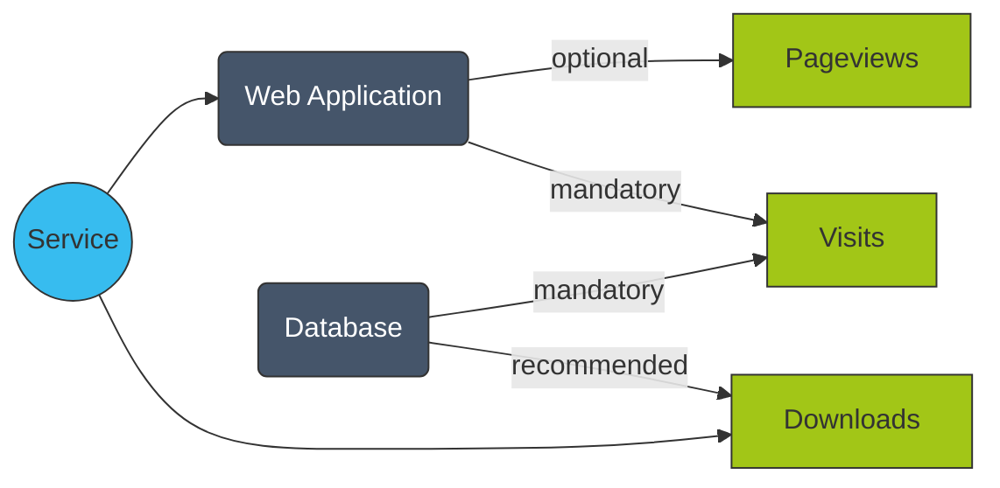

import Mermaid from '@components/mdx/Mermaid.astro'

Service Providers can define their indicator set by selecting one of the predefined category indicator sets. 
Each category has a set of indicators that are relevant for that category. 
For example, the "Web Application" category has the indicators "Pageviews" and "Visits", while the "Database" category has the indicators "Visits" and "Downloads".

<Mermaid>

</Mermaid>

If a category set does not fit the entirety of the service, the service provider can opt to add additional indicators to the service. 
For example, a web application might allow to download some files, but the "Web Application" category does not include the "Downloads" indicator. 
In this case, the service provider can add the "Downloads" indicator to the service indicator set.

### Necessities

The category indicator sets define the indicators with different levels of necessity.
The indicators can have the necessity "Mandatory", "Recommended" or "Optional".
A service provider must submit KPIs for all mandatory indicators, while it is recommended to submit KPIs for the recommended indicators.
The optional indicators can be submitted, but it is not required to submit them.
To ensure the quality of the data, the system will validate the submitted KPIs and reject any submission that does not include all mandatory indicators.
In order to enable a comprehensive service evaluation, it is recommended to submit KPIs for all possible indicators, including the optional ones.
Indicators that are not included in the category indicator set, but are added to the service indicator set by the service provider, are considered optional and can be submitted, but it is not required to submit them.